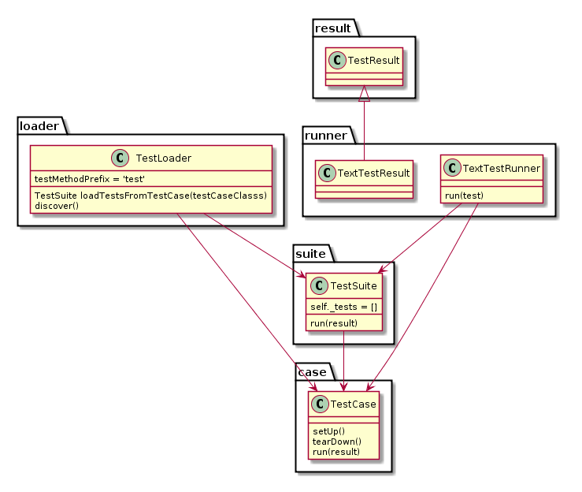

# Unittest整理

###  深入理解unittest-整理
http://www.cnblogs.com/hackerain/p/3682019.html

* Testcase的实例就是测试用例，测试用例是一个完成的测试流程，包括测试环境的的搭建setUp，执行测试代码run，以及测试后环境的还原tearDown
多个测试用例集合在一起就是TestSuite，而TestSuite也可以嵌套TestSuite
* TestLoader是用例是加载TestCase到TestSuite中的，其中有几个loadTestsFrom_()方法，就是从各个地方来寻找TestCase，
创建他们的实例，然后add到TestSuite中，在返回一个TestSuite的实例。
* TextTestRunner是用来执行测试用例的，其中的run(test)会执行TestSuite/TestCase中的run(result)方法
测试结果会保存在TextTestResult实例中，其中包括执行多少的测试用例，成功多少，失败多少等信息

* 所以测试流程是，我们写好TestCase，然后用TestLoader将TestCase加载到TestSuite中，然后用TextTestRunner运行TestCase，
将运行结果记录在TestResult中，整个过程继承在unittest.main模块中。
* fixture通过覆盖TestCase中的setUp()和tearDown()方法来实现，比如测试用例中需要访问数据库，
那么可以在setUp()中建立数据库连接以及一些初始化，在tearDown()中清除在数据库中产生的数据，然后关闭连接
* 通过看TestLoader驶入和加载测试用例的，就知道在一个类中什么是测试用例，到底是这个类还是类中具体的测试方法。（可参见连接中举出的例子）
有的测试用例的fixture是相同的，如果每个测试用例都单独携程TestCase的话，会有很多的冗余代码，所以将他们写在同一类中的不同方法。

### 深入解读Python的unittest并拓展HTMLTestRunner
http://www.cnblogs.com/hhudaqiang/p/6596043.html

